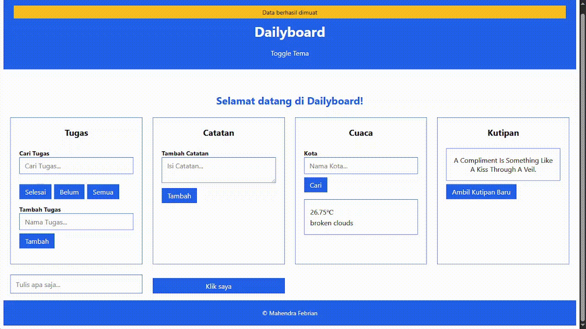

# Dailyboard

_Dailyboard_ — Dashboard produktivitas harian berisi daftar tugas (To-do list), catatan cepat (Notes), hingga widget cuaca, seluruhnya dibangun dengan HTML, CSS, dan Javascript murni.



## Fitur

- Daftar Tugas
- Catatan Cepat
- Widget Cuaca
- Widget Kutipan
- Tema Gelap

## Cara Pakai

- Buka `index.html` di browser apa pun atau kunjungi [GitHub Pages](https://mahendra-febrian.github.io/dailyboard) dari repositori ini untuk melihat halaman web Dailyboard.
- Ketuk setiap fitur yang relevan.
- Ketuk dua kali tugas atau catatan cepat untuk mengubah nama/isinya.
- Geser _(Drag)_ tugas dan jatuhkan _(Drop)_ untuk mengubah urutan/priotitasnya.

## Struktur

```text
dailyboard\
    ├── index.html
    ├── style.css
    ├── script.js
    ├── tugas.js
    ├── catatan.js
    ├── storage.js
    ├── api.js
```
